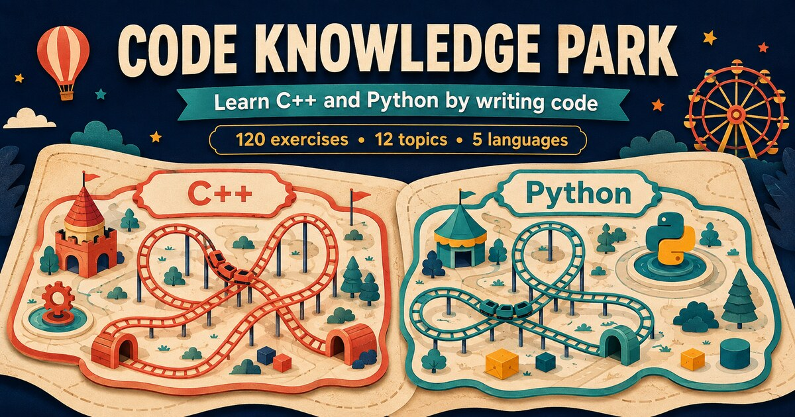

# Code Knowledge Park

[](https://yevheniimalin.github.io/cpp-learning-park/)


An interactive browser game for learning C++ and Python through clear explanations, deliberate repetition and practical coding exercises.



## About the project

Code Knowledge Park opens with a course-selection portal and contains two independent learning routes. Each route has six stations, ten coding exercises per station, visible program output, beginner-friendly syntax explanations and precise feedback.

The project is designed for complete beginners. New symbols are explained before they are required in an exercise. Progress for C++ and Python is stored separately in the learner's browser.

## Features

- Two complete learning routes: C++ and Python
- 120 coding exercises across 12 stations
- 10 exercises per topic for deliberate repetition
- Detailed syntax breakdowns before practice
- In-browser code editors with task-specific starter code
- Visible expected program output after every successful check
- Actionable diagnostics for misspelled words, missing symbols and common syntax mistakes
- Previous and next controls beside the code checker
- Next exercise unlocks only after a successful solution
- Separate C++ and Python progress stored locally in the browser
- Protected global and per-station progress resets
- Responsive layout for desktop and mobile
- Complete interface in English, Finnish, Ukrainian, Russian and Thai

## Curriculum

| C++ route | Python route | Exercises |
| --- | --- | ---: |
| Program structure and output | `print`, strings and output | 10 + 10 |
| Variables, types and arithmetic | Values, variables and conversions | 10 + 10 |
| Conditions and loops | Conditions, indentation and loops | 10 + 10 |
| Functions and return values | Functions, parameters and return | 10 + 10 |
| References and pointers | Lists and dictionaries | 10 + 10 |
| Classes, objects and methods | Classes, objects and methods | 10 + 10 |

## Technology

- HTML5
- Modern CSS
- Vanilla JavaScript
- Canvas animation
- Browser `localStorage`
- GitHub Pages

The GitHub Pages edition has no build step, package manager or external runtime dependency.

## Run locally

```bash
git clone https://github.com/YevheniiMalin/cpp-learning-park.git
cd cpp-learning-park
python -m http.server 8000
```

Then open `http://localhost:8000`.

## Validation model

The trainer checks the expected structure and logic of each solution. It does not execute arbitrary C++ or Python code, so it can provide immediate beginner-friendly feedback without a backend server.

## License

This project is available under the [MIT License](LICENSE).

## Author

Created by [Yevhenii Malin](https://github.com/YevheniiMalin).
